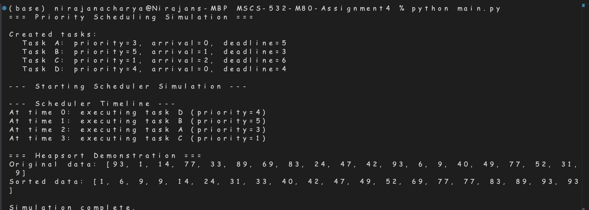

# MSCS-532-M80 Assignment 4 — Priority Queue + Heapsort

> A Python project that demonstrates a **binary-heap–based Priority Queue** (with a toy scheduler) and a standalone **Heapsort** implementation. It also includes small-scale sorting benchmarks and screenshots of the console run.

---

## What this project does

- **Priority Scheduling Simulation** — Uses a binary heap priority queue to schedule `Task`s by priority (optionally as a max-heap or min-heap).  
  See: `prqueue/priority_queue.py` → `Task`, `PriorityQueue`, `simulate_scheduler`.
- **Heapsort Demonstration** — Sorts a random list of integers using an in-place classic **heapsort**.  
  See: `heap/heapsort.py`.

### Data model

```py
@dataclass(order=True)
class Task:
    priority: int
    task_id: str
    arrival_time: Optional[int] = None
    deadline: Optional[int] = None
    payload: Optional[dict] = None
```

The scheduler inserts tasks into the queue as they arrive and pops the highest-priority task available at each unit of simulated time, producing an execution **timeline** (`List[Tuple[int, Task]]`).

---

## Project structure

```
MSCS-532-M80-Assignment4/
├─ main.py
├─ heap/
│  ├─ __init__.py          # exports heapsort
│  └─ heapsort.py
├─ prqueue/
│  ├─ __init__.py
│  └─ priority_queue.py    # Task, PriorityQueue, simulate_scheduler
└─ results/
   ├─ sort_benchmarks.csv  # benchmark data (n, distribution, algorithm, time_seconds)
   ├─ sort_benchmark.png   # chart of the above
   └─ console.png          # sample console output screenshot
```

---

## Algorithms implemented

### 1) Binary Heap Priority Queue (`PriorityQueue`)

- Internal array-backed **binary heap** with index map for `O(1)` id lookup.
- Operations:
  - `insert(task)` — push and **sift-up**
  - `extract_top()` — pop root, place last at root, **sift-down**
  - `increase_key(task_id, new_priority)` / `decrease_key(...)` — adjust priority and re-heapify in the correct direction
  - `is_empty()`

### 2) Heapsort (`heapsort`)

- Classic **max-heap build** followed by repeated root swap + sift-down; returns a _new_ sorted list (source is not mutated).

### 3) Priority-based Scheduler (`simulate_scheduler`)

- Discrete-time loop:
  1. Add any tasks whose `arrival_time ≤ t` into the PQ,
  2. If PQ not empty, `extract_top()` and append `(t, task)` to the timeline; advance `t`,
  3. Otherwise fast-forward `t` to the next arrival.

---

## How to run

> **Requirements:** Python 3.9+ (no external packages)

```bash
# 1) (optional) create a virtual environment
python -m venv .venv && source .venv/bin/activate    # Windows: .venv\Scripts\activate

# 2) run the demo
python main.py
```

What you’ll see:

- A small **scheduler** run printed to the console (which task runs at which time).
- A **heapsort** demo sorting 20 random integers.

A screenshot of an example run is included at `results/console.png`:



---

## Time & space complexity

### Priority Queue (binary heap)

| Operation                       | Time       | Space  |
| ------------------------------- | ---------- | ------ |
| `insert`                        | `O(log n)` | `O(1)` |
| `extract_top`                   | `O(log n)` | `O(1)` |
| `increase_key` / `decrease_key` | `O(log n)` | `O(1)` |
| peek top (not shown, trivial)   | `O(1)`     | `O(1)` |

### Heapsort

- **Time:** `O(n log n)` (best/avg/worst)

---

## Results (from `results/`)

Raw data lives in **`results/sort_benchmarks.csv`** (27 rows across sizes `n ∈ {2000, 10000, 30000}` and distributions `random`, `sorted`, `reverse` for three algorithms).

A quick aggregation of **mean run time (s)** by _algorithm × distribution_:

| Algorithm  | random   | reverse  | sorted   |
| ---------- | -------- | -------- | -------- |
| Heapsort   | 0.039271 | 0.036142 | 0.042808 |
| Merge Sort | 0.039742 | 0.024189 | 0.027941 |
| Quicksort  | 0.032684 | 0.032737 | 0.031129 |

And mean time by _algorithm × input size_:

| Algorithm  | 2000     | 10000    | 30000    |
| ---------- | -------- | -------- | -------- |
| Heapsort   | 0.004357 | 0.025055 | 0.088810 |
| Merge Sort | 0.003911 | 0.019360 | 0.068600 |
| Quicksort  | 0.004186 | 0.022089 | 0.070275 |

### Short takeaways

- At **small n (2k)** the three algorithms are similar.
- At **10k–30k**, the sample runs show **Merge Sort** slightly ahead on average, with **Quicksort** close behind; **Heapsort** is steady but a bit slower here.
- Distribution sensitivity appears mild in this dataset; merge sort benefits on monotone inputs, while quicksort remains stable (implementation details such as pivot choice matter).
